# Ecommerce 2.0

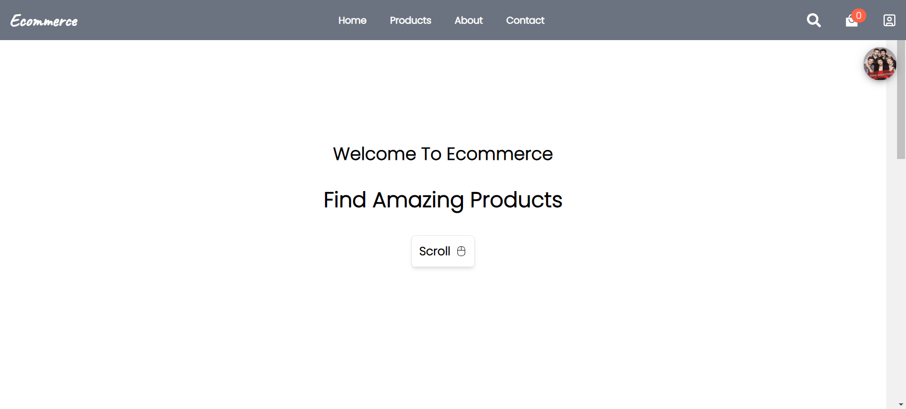
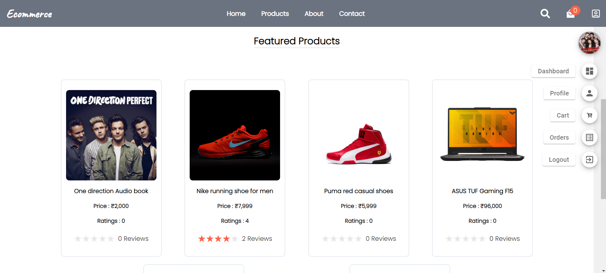
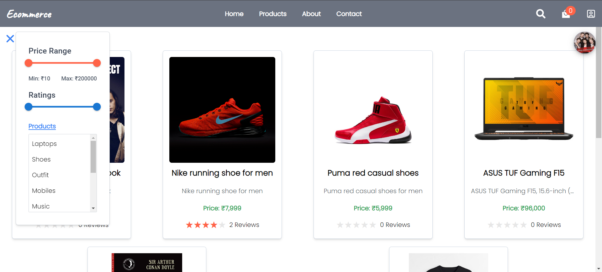
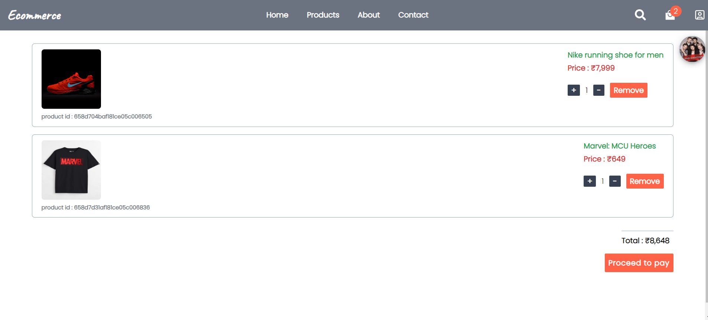
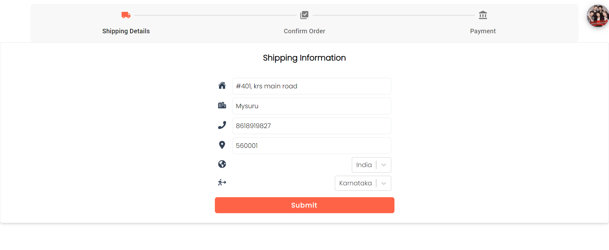
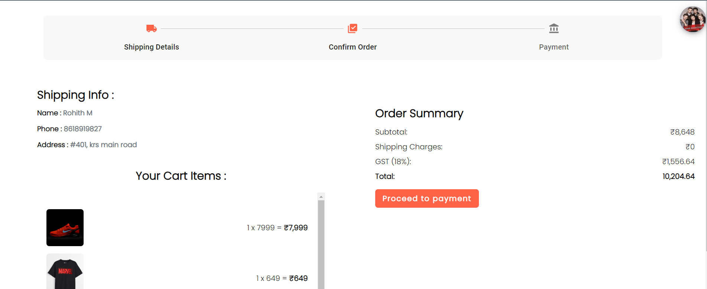
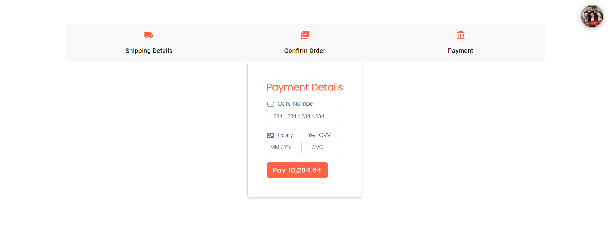
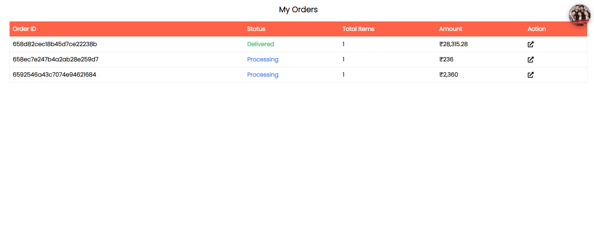
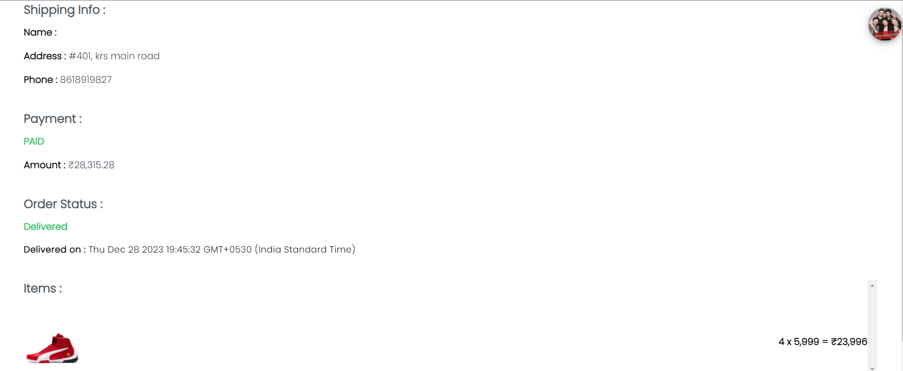
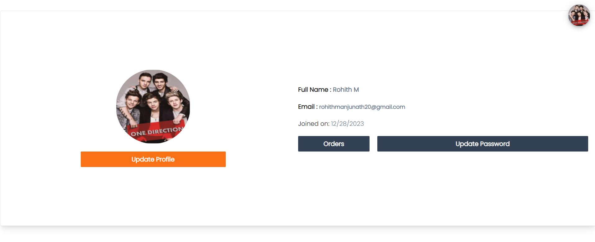
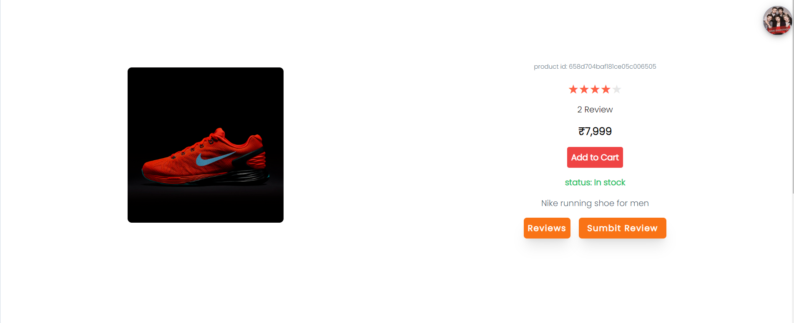
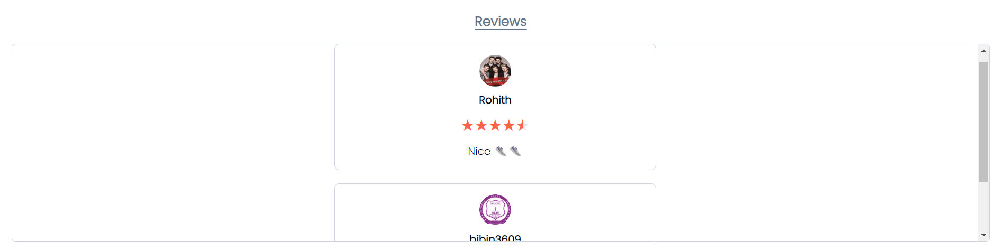
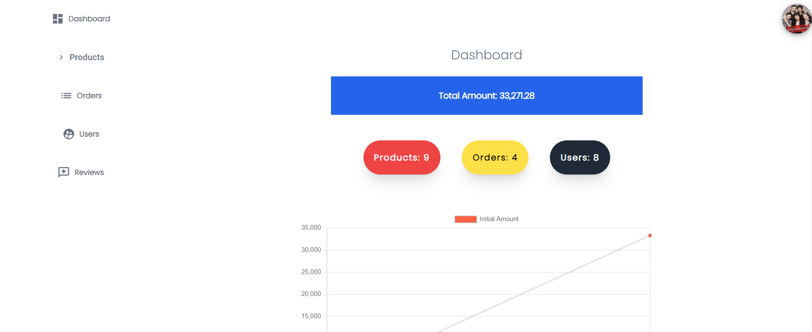

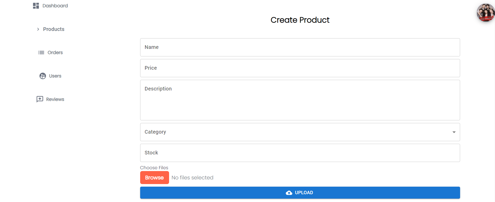
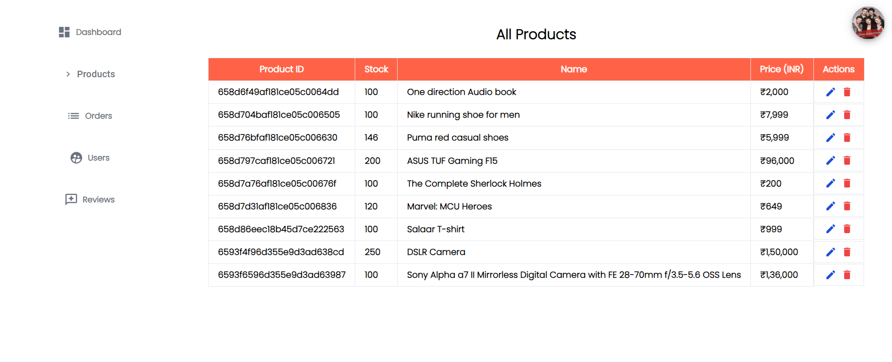
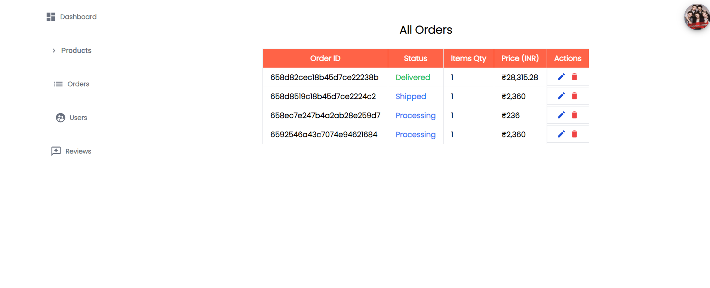
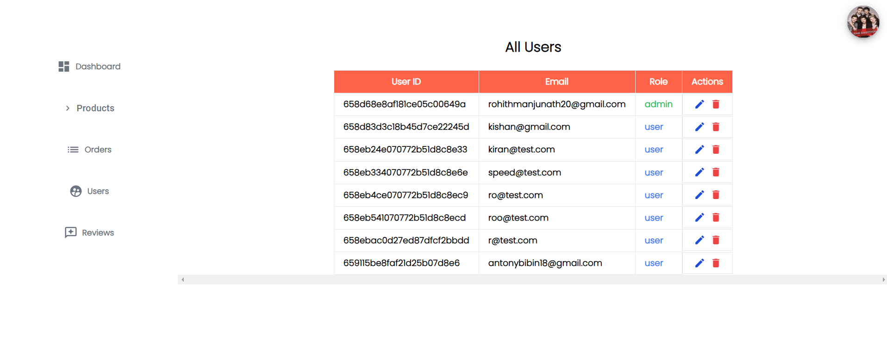
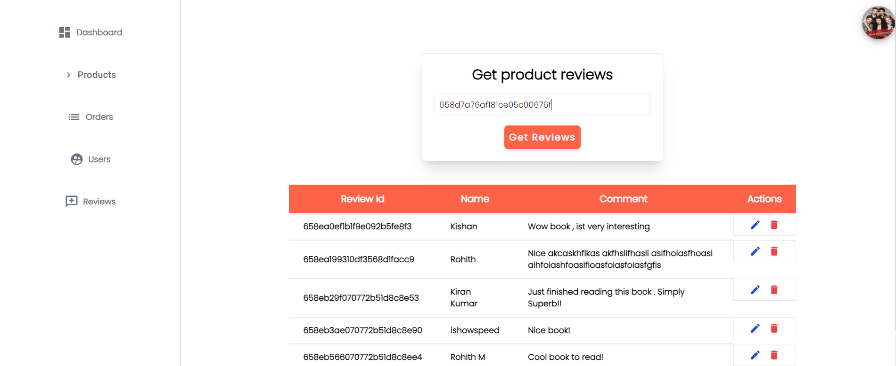
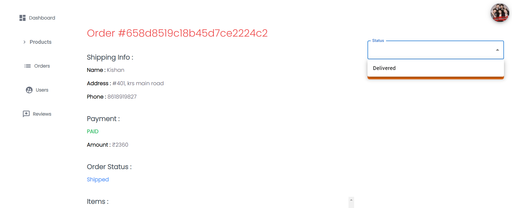
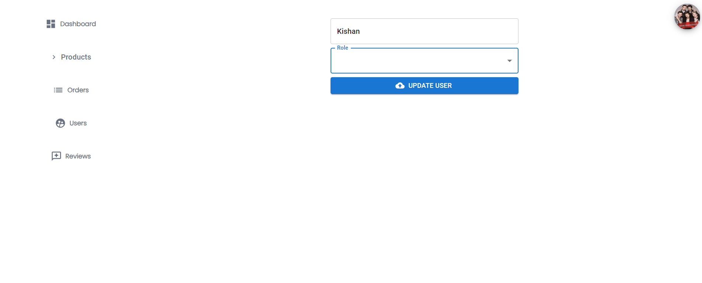

## Overview

Welcome to Your eCommerce Website, a full-stack MERN (MongoDB, Express, React, Node.js) eCommerce application. This project allows users to browse products, add them to their cart, and complete the checkout process.

## Features

- **Product Catalog:** View a wide range of products with detailed information.
- **User Authentication:** Register, log in, and log out securely.
- **Shopping Cart:** Add products to the cart, update quantities, and remove items.
- **Checkout Process:** Complete the purchase with secure payment processing.
- **User Dashboard:** View order history and manage account details.
- **Admin Panel:** Manage products, orders, and user accounts.

## Technologies Used

- **Frontend:**
  - React
  - Redux Toolkit(State Management)
  - React Router (Navigation)
  - Material-UI (UI Components)

- **Backend:**
  - Node.js
  - Express.js
  - MongoDB (Database)
  - Mongoose (ODM)
  - JWT (Authentication)
  - bcrypt (Password Hashing)
  
- **Payment Gateway:**
  - Stripe (or any other payment gateway)

## Live Link

 - [LiveDemo](https://ecommerce20.netlify.app/)

## Stay-in-Touch

Connect with me on social media:

## Connect with Me

Feel free to connect with me on professional platforms:

 

